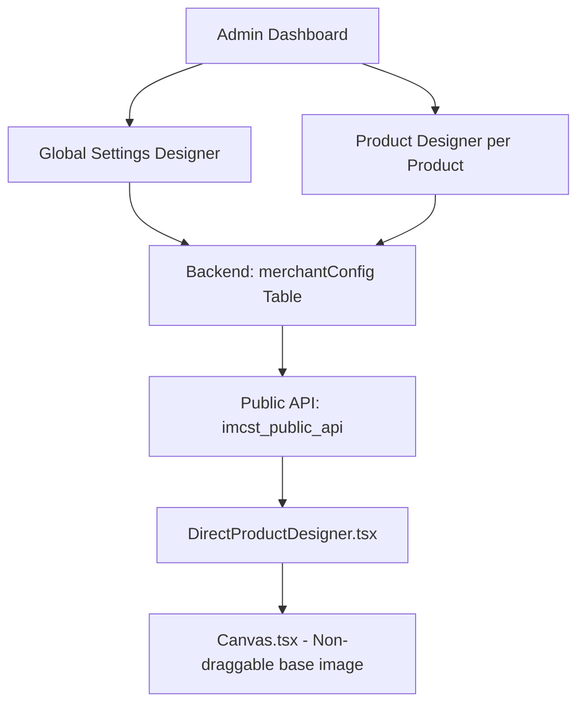

# Implementation Plan: Base Image Size Settings

## Overview
Menambahkan pengaturan ukuran base image di admin Shopify untuk fitur Direct Customize di storefront.

## Requirements Summary
1. **Canvas Size** - Ukuran canvas bisa diatur di admin (default: 1000px)
2. **Base Image Scale** - Base image bisa di-zoom in/out sebagai persentase canvas (10%-100%, default: 80%)
3. **Non-movable Base Image** - Base image tidak bisa digerakkan/drag, hanya bisa di-zoom
4. **Remove Lock Feature** - Hapus fitur lock yang sudah ada, base image selalu fixed position
5. **Scope** - Hanya admin yang bisa mengatur, customer hanya melihat hasil
6. **Locations** - Global Settings Designer + Product Designer (per product)

---

## Architecture Diagram



---

## Implementation Steps

### Phase 1: Database Schema Update
**File:** `backend/prisma/schema.prisma`

Tambahkan field baru di model `MerchantConfig`:
```prisma
baseImageScale      Float?  @default(80)    // Percentage 10-100
customCanvasSize    Json?   // { width: 1000, height: 1000 }
// lockBaseImage: COMMENT OUT only, do NOT delete for backward compatibility
// baseImage: Keep existing
```

**Note:** Jangan hapus field dari schema - hanya comment/deprecate untuk backward compatibility dengan existing data.

---

### Phase 2: Backend API Updates
**File:** `backend/routes/products.routes.js`

1. Update `allowedFields` array:
   ```javascript
   const allowedFields = [
       // ... existing fields ...
       'baseImageScale',      // ADD
       'customCanvasSize',    // ADD
       // 'lockBaseImage' - KEEP in allowedFields (ignore di logic)
   ];
   ```

2. **Tambahkan Validasi untuk baseImageScale:**
   ```javascript
   // Dalam route POST /config
   if (configData.baseImageScale !== undefined) {
       const scale = Number(configData.baseImageScale);
       if (scale < 10 || scale > 100) {
           return res.status(400).json({ 
               error: "baseImageScale harus antara 10-100" 
           });
       }
   }
   ```

3. **Default Values Handling:**
   ```javascript
   // Saat load config, set defaults
   const configWithDefaults = {
       ...config,
       baseImageScale: config.baseImageScale ?? 80,
       customCanvasSize: config.customCanvasSize ?? { width: 1000, height: 1000 }
   };
   ```

---

### Phase 3: Frontend Types Update
**File:** `frontend/src/types.ts`

Update interface `PageData` dan config types:
```typescript
interface CanvasConfig {
  baseImageScale?: number;      // 10-100 percentage
  canvasSize?: {                 // Custom canvas dimensions
    width: number;
    height: number;
  };
}

// PageData - lockBaseImage deprecated, base image always non-movable
interface PageData {
  id: string;
  name: string;
  elements: CanvasElement[];
  baseImage?: string;
  baseImageProperties?: {
    x: number;
    y: number;
    scale: number;
    width?: number;
    height?: number;
  };
  // lockBaseImage: REMOVE from interface
}
```

---

### Phase 4: Admin Settings Pages

#### 4.1 Global Settings Designer
**File:** `frontend/src/pages/GlobalSettingsDesigner.tsx`

**UI Controls untuk ditambahkan:**

1. **Canvas Size Section:**
   ```tsx
   <div className="space-y-4">
     <Text variant="headingMd" as="h2">Canvas Dimensions</Text>
     <div className="flex gap-4">
       <TextField
         label="Width (px)"
         type="number"
         value={canvasSize.width.toString()}
         onChange={(v) => setCanvasSize({...canvasSize, width: Number(v)})}
       />
       <TextField
         label="Height (px)"
         type="number"
         value={canvasSize.height.toString()}
         onChange={(v) => setCanvasSize({...canvasSize, height: Number(v)})}
       />
     </div>
     <Button onClick={resetToDefaults} variant="secondary">
       Reset to Defaults (1000x1000)
     </Button>
   </div>
   ```

2. **Base Image Scale Section:**
   ```tsx
   <div className="space-y-4">
     <Text variant="headingMd" as="h2">Base Image Scale</Text>
     <div className="flex items-center gap-4">
       <Slider
         label="Scale"
         min={10}
         max={100}
         value={baseImageScale}
         onChange={setBaseImageScale}
         output
       />
       <Badge>{baseImageScale}%</Badge>
     </div>
     <p className="text-sm text-gray-600">
       {baseImageScale}% of canvas width
     </p>
   </div>
   ```

3. **Hapus** semua kontrol terkait `lockBaseImage` toggle.

4. **Reset to Defaults Function:**
   ```tsx
   const resetToDefaults = () => {
     setCanvasSize({ width: 1000, height: 1000 });
     setBaseImageScale(80);
   };
   ```

#### 4.2 Product Designer (per product)
**File:** `frontend/src/pages/Designer.tsx`

Sama seperti Global Settings, tambahkan controls dan hapus lock feature.

---

### Phase 5: Canvas Component - Remove Drag Functionality
**File:** `frontend/src/components/Canvas.tsx`

**PENTING:** Hapus drag functionality untuk base image:

```typescript
// Line ~347 - Current drag implementation:
// SEBELUM:
<motion.div
  drag={(!isPublicMode && !lockBaseImage) ? true : false}
  dragMomentum={false}
  onDrag={(_e, info) => {
    onUpdateBaseImage({
      x: (baseImageProperties?.x || 0) + info.delta.x / zoomMult,
      y: (baseImageProperties?.y || 0) + info.delta.y / zoomMult,
    });
  }}
>

// SESUDAH:
<motion.div
  drag={false}  // Base image tidak bisa digerakkan
  dragMomentum={false}
  className="absolute pointer-events-none"
>
```

**Prop cleanup:**
```typescript
interface CanvasProps {
  // ...
  lockBaseImage?: boolean;  // REMOVE dari interface
  // ...
}
```

---

### Phase 6: DirectProductDesigner Integration
**File:** `frontend/src/pages/DirectProductDesigner.tsx`

1. **Update canvas dimensions calculation:**
   ```typescript
   // Line 337-342 - Current canvas dimensions calculation
   const canvasWidth = (config?.paperSize === 'Custom' && config?.customPaperDimensions?.width)
       ? config.customPaperDimensions.width * getPixelsPerUnit()
       : (config?.customCanvasSize?.width || 1000);  // Use customCanvasSize

   const canvasHeight = (config?.paperSize === 'Custom' && config?.customPaperDimensions?.height)
       ? config.customPaperDimensions.height * getPixelsPerUnit()
       : (config?.customCanvasSize?.height || 1000);
   ```

2. **Update baseImageProperties dengan scale:**
   ```typescript
   baseImageProperties={{
       x: 0,  // Always center
       y: 0,  // Always center
       scale: (config?.baseImageScale || 80) / 100,  // Convert percentage to scale
       width: config?.customCanvasSize?.width || 1000,
       height: config?.customCanvasSize?.height || 1000,
       ...(config?.baseImageProperties || {}),
       ...(activePage?.baseImageProperties || {})
   }}
   ```

3. **Simplify onUpdateBaseImage (hanya scale):**
   ```typescript
   onUpdateBaseImage={(updates) => {
       // Hanya allow scale update
       if (updates.scale !== undefined) {
           setPages(prev => prev.map(p => {
               if (p.id === activePage?.id) {
                   return {
                       ...p,
                       baseImageProperties: {
                           x: 0,  // Always center
                           y: 0,  // Always center
                           scale: updates.scale,
                           width: p.baseImageProperties?.width || 1000,
                           height: p.baseImageProperties?.height || 1000
                       }
                   };
               }
               return p;
           }));
       }
   }}
   ```

---

### Phase 7: Clean Up Related Code

#### 7.1 Files to update:
- `frontend/src/components/Canvas.tsx` - Remove drag, remove `lockBaseImage` prop
- `frontend/src/pages/DirectProductDesigner.tsx` - Use new config, remove lockBaseImage
- `frontend/src/components/DesignerCore.tsx` - Remove prop dan logic
- `frontend/src/pages/GlobalSettingsDesigner.tsx` - Add new controls, remove lock UI
- `frontend/src/pages/Designer.tsx` - Same as Global Settings

#### 7.2 Visual Preview:
Di admin pages (GlobalSettingsDesigner, Designer), saat slider berubah:
- Canvas sudah re-render dengan `baseImageProperties.scale` baru
- Tidak perlu extra logic - cukup pass scale ke Canvas component

---

## File Changes Summary

| File | Changes |
|------|---------|
| `backend/prisma/schema.prisma` | Add `baseImageScale`, `customCanvasSize` (comment out lockBaseImage) |
| `backend/routes/products.routes.js` | Add fields to `allowedFields`, add validation, set defaults |
| `frontend/src/types.ts` | Add `CanvasConfig`, remove `lockBaseImage` from interfaces |
| `frontend/src/pages/GlobalSettingsDesigner.tsx` | Add slider + inputs, reset button, remove lock UI |
| `frontend/src/pages/Designer.tsx` | Add same controls, remove lock UI |
| `frontend/src/components/Canvas.tsx` | Remove drag functionality, remove `lockBaseImage` prop |
| `frontend/src/pages/DirectProductDesigner.tsx` | Use new config, base image always centered |

---

## Testing Checklist

- [ ] Default values (1000px canvas, 80% scale) work correctly
- [ ] Custom canvas size is respected in Direct Product Designer
- [ ] Base image scale is applied correctly (80% = 0.8 scale)
- [ ] Base image CANNOT be dragged/moved (always fixed position)
- [ ] Settings saved/loaded correctly from backend
- [ ] Validation prevents scale < 10 or > 100
- [ ] Reset to defaults button works
- [ ] Global settings apply when no per-product override
- [ ] Per-product settings override global settings
- [ ] Lock Base Image feature is completely removed from admin UI
- [ ] Backward compatibility with existing designs (no errors)

---

## Migration Strategy

1. **Existing configs tanpa field baru:**
   - Backend sets defaults saat load: `baseImageScale = 80`, `customCanvasSize = {width: 1000, height: 1000}`
   - Frontend handles undefined dengan default values

2. **Existing configs dengan lockBaseImage:**
   - Ignore field ini sepenuhnya
   - Base image selalu non-movable

3. **Testing migration:**
   ```javascript
   // Test case 1: Empty config
   {} → { baseImageScale: 80, customCanvasSize: {width: 1000, height: 1000} }
   
   // Test case 2: Old config with lockBaseImage
   { lockBaseImage: false } → { baseImageScale: 80, customCanvasSize: {width: 1000, height: 1000} }
   
   // Test case 3: New config with custom values
   { baseImageScale: 50 } → { baseImageScale: 50, customCanvasSize: {width: 1000, height: 1000} }
   ```
